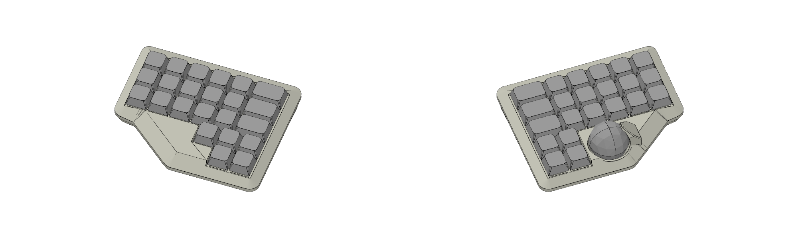
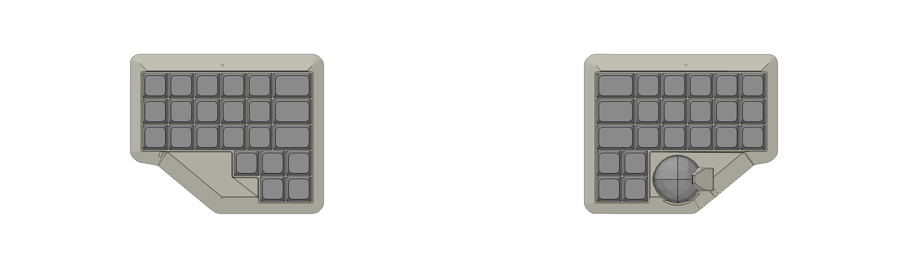
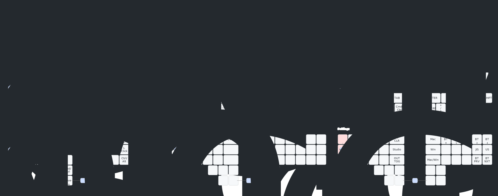

# Surround1x0-AKDK

Generated by [Auto-Keyboard-Design-Kit](https://auto-kdk.pages.dev/)

## Preview

- 3D View

- Top View

## Keymap

Mac/Win と US/JIS の差分キーは、それぞれ `Mac/Win` と `US/JIS` の順で表記しています。SVG は `config/keymap.keymap` から自動生成されます。

## Parts List

|Part|Quantity|
|---|---|
|wireless controller|2|
|Conthrough(2.5mm, 9pin)|4|
|Battery|2|
USB-C cable|1|
|Choc V2 switch and socket|45|
|Diode|45|
|Keycap|45|
